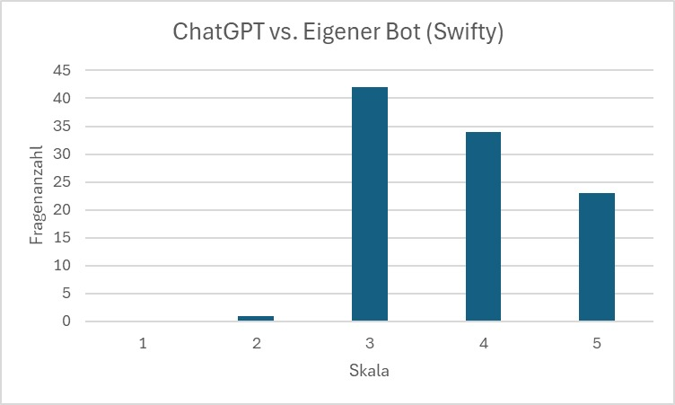
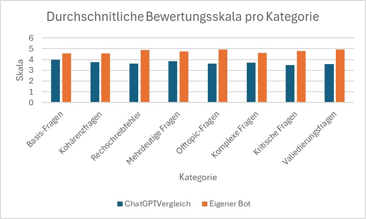

# Chatbot Evaluation Dashboard – Vollständige Dokumentation

## Inhaltsverzeichnis

- [Einführung](#einführung)
- [1. Ziele](#1-ziele)
- [2. Vorgehen / Umsetzung](#2-vorgehen--umsetzung)
- [3. Ergebnisse](#3-ergebnisse)
- [4. Verwendete Tools / Bibliotheken](#4-verwendete-tools--bibliotheken)
- [5. Bewertungsrichtlinien und Qualitätssicherung](#5-bewertungsrichtlinien-und-qualitätssicherung)

---

## Einführung

Diese Dokumentation beschreibt das Chatbot Evaluation Dashboard, seine technische Umsetzung und die Bewertungsrichtlinien für die manuelle Evaluation. Der Aufbau folgt der Logik: Ziele, technisches Vorgehen, erzielte Ergebnisse, eingesetzte Werkzeuge und die prozeduralen Vorgaben für Rater. Die Bewertung erfolgt nach einem standardisierten Bewertungshandbuch; die zentralen Inhalte sind in Abschnitt 5 zusammengefasst. Das vollständige Handbuch liegt unter `testing_chatbot/Bewertungshandbuch.md` vor.

### Warum ist Testing für Chatbots essentiell?

Chatbots, die in produktiven Umgebungen eingesetzt werden (wie der FH-SWiFty-Chatbot für die Fachhochschule Südwestfalen), müssen hohe Qualitätsstandards erfüllen. Systematisches Testing und Auswertung sind kritisch, um sicherzustellen, dass der Chatbot zuverlässig ist und korrekte Informationen liefert, hilfreich ist und Nutzerfragen angemessen beantwortet, vertrauenswürdig ist und keine Fehlinformationen verbreitet, sowie kontinuierlich verbessert werden kann durch datenbasierte Erkenntnisse.

Ohne Testing können Fehler unentdeckt bleiben, was zu Frustration bei Nutzern, Reputationsschäden und Verlust von Vertrauen führen kann. Besonders in Bildungseinrichtungen, wo Chatbots wichtige Informationen zu Studiengängen, Bewerbungsfristen und Kontaktdaten liefern, ist Qualitätssicherung unverzichtbar.

### Die Besonderheit manueller Auswertung

Während automatisierte Tests (z.B. mit LLM-Judges) wertvoll sind, hat manuelle Auswertung einzigartige Vorteile, die sie unverzichtbar machen.

**Kontextuelles und menschliches Verständnis**: Menschen verstehen Nuancen, die Maschinen übersehen können. Dazu gehören der Ton und die Höflichkeit - passt der Kommunikationsstil zur Zielgruppe (z.B. Studienanfänger)? Ebenso wichtig ist die kulturelle Sensibilität - sind Formulierungen angemessen und respektvoll? Schließlich die praktische Relevanz - ist die Antwort tatsächlich hilfreich für den konkreten Nutzerkontext?

**Subjektive Qualitätsdimensionen**: Viele Qualitätsaspekte sind subjektiv und schwer zu automatisieren. Dazu zählen die Verständlichkeit - ist die Antwort für die Zielgruppe verständlich? Die Vollständigkeit - enthält die Antwort alle wichtigen Informationen? Die Relevanz - beantwortet die Antwort wirklich die gestellte Frage? Und die Benutzerfreundlichkeit - ist die Antwort gut strukturiert und leicht zu lesen?

**Qualitatives und konstruktives Feedback**: Manuelle Auswertung liefert detaillierte Notizen und konstruktive Kritik. Evaluatoren können spezifische Verbesserungsvorschläge geben (Was fehlt?), positive Aspekte identifizieren (Was ist gut?), und kontextuelle Anmerkungen machen, die erklären, warum eine Antwort gut oder schlecht ist.

---

## 1. Ziele

Die Entwicklung des Chatbot Evaluation Dashboards verfolgte folgende Ziele in zeitlicher Reihenfolge:

### Phase 1: Grundlegende Evaluation-Infrastruktur
- **Manuelle Bewertung von Chatbot-Antworten** ermöglichen
- **Strukturierte Datenspeicherung** für Bewertungen implementieren
- **Live-Abruf von Chatbot-Antworten** direkt vom produktiven Agent
- **Likert-Skala Bewertungssystem** (1-5) für qualitative Bewertung

### Phase 2: Vergleichsanalyse
- **ChatGPT-Vergleichsfunktion** zur Benchmarking der eigenen Chatbot-Antworten
- **KPIs-Messung** (Antwortzeit, Zeichenanzahl, Differenzen)
- **Vergleichsbewertung** zwischen eigenem Bot und ChatGPT

### Phase 3: Analyse und Visualisierung
- **Statistische Auswertung** aller Bewertungen
- **Visuelle Diagramme** für Verteilungen und Trends
- **Fortschrittsüberwachung** über alle Testkategorien
- **Datenexport-Funktion** für weitere Analysen

### Phase 4: Integration und Optimierung
- **Nahtlose Integration** mit dem produktiven Chatbot-Agent (`agent_langgraph_app.py`)
- **Tool-Kompatibilität** ohne Chainlit-Kontext (für Streamlit-Umgebung)
- **Fehlerbehandlung** und robuste Fehlermeldungen

---

## 2. Vorgehen / Umsetzung

Im Folgenden werden die Architektur des Dashboards, der Datenfluss, die Tab-Struktur, die verwendeten Datenformate sowie Installation und Fehlerbehandlung beschrieben.

### 2.1 Architektur-Entscheidungen

#### Live-Agent-Integration
Das Dashboard verwendet **exakt den gleichen Agent** wie die produktive Chatbot-Anwendung:

**Code-Referenz**: `testing_chatbot/app.py` (Zeilen 63-75)
```python
@st.cache_resource
def initialize_agent():
    # Exakt wie in fh-swifty-chatbot/agent_langgraph_app.py
    model = ChatOpenAI(model="gpt-4o", streaming=True)
    tools = [find_info_on_fhswf_website]
    agent = create_react_agent(model=model, tools=tools, prompt=prompt_langgraph)
    return agent
```

**Vorteil**: Garantiert, dass die Evaluation mit der produktiven Konfiguration durchgeführt wird.

#### Tool-Anpassung für Streamlit
Das Tool `find_info_on_fhswf_website` wurde angepasst, um ohne Chainlit-Kontext zu funktionieren:

**Code-Referenz**: `fh-swifty-chatbot/helpers/tools.py`
- Bedingte Chainlit-Integration: Tool prüft zur Laufzeit, ob Chainlit-Kontext verfügbar ist
- Graceful Degradation: Funktioniert sowohl in Chainlit- als auch in Streamlit-Umgebung

### 2.2 Datenfluss-Implementierung

```
1. User öffnet Dashboard
   ↓
2. Agent wird initialisiert (einmalig, gecacht via @st.cache_resource)
   ↓
3. Testdaten werden aus test_data/*.json geladen (bevorzugt chatbot_tests_fragen.json; app.py, load_test_data Zeilen 144-165)
   ↓
4. Gespeicherte Bewertungen werden aus manual_ratings.json geladen
   ↓
5. User interagiert:
   - Klickt "Antwort vom Agent abrufen"
     → ask_agent() wird aufgerufen (Code: app.py, Zeilen 77-141, ask_agent_async + ask_agent)
     → Agent antwortet live über asyncio
     → Antwort wird in manual_ratings.json gespeichert
   - Bewertet Antwort (1-5)
     → Bewertung wird in manual_ratings.json gespeichert
   - Ruft ChatGPT-Antwort ab (Tab 4)
     → get_chatgpt_answer() (app.py Zeile 207) wird aufgerufen (z. B. Zeile 1014)
     → Vergleichsdaten werden in manual_ratings.json gespeichert
   ↓
6. Statistiken werden aus manual_ratings.json berechnet (Code: app.py, Tab 3, Zeilen 663-858)
   ↓
7. Visualisierungen werden im Tab Statistiken generiert (app.py, Zeilen 714-820)
```

### 2.3 Dashboard-Struktur

Das Dashboard ist in 4 Tabs organisiert:

#### Tab 1: Bewertung
**Code-Referenz**: `testing_chatbot/app.py` (Zeilen 355-556)

Dieser Tab ermöglicht die manuelle Bewertung einzelner Tests nach den im Bewertungshandbuch definierten Kriterien (siehe Abschnitt 5). Die Funktionalitäten umfassen:
- Test-Auswahl mit Filtern (Kategorie, Test-Typ, nur unbewertete)
- Live-Abruf der Chatbot-Antwort direkt vom Agent
- Likert-Skala Bewertung (1-5) mit detaillierten Beschreibungen
- Notizen-Textfeld für qualitative Anmerkungen (entsprechend Abschnitt 5.4)
- Speichern-Funktion zur Persistierung der Bewertungen

#### Tab 2: Übersicht
**Code-Referenz**: `testing_chatbot/app.py` (Zeilen 558-661)

Die Übersicht bietet eine tabellarische Darstellung aller Bewertungen:
- Vollständige Tabelle mit allen gespeicherten Bewertungen
- Spalten-Filter für verschiedene Datenkategorien (Basis-Informationen, Antworten & Zeiten, ChatGPT-Vergleich)
- Sortier- und Filterfunktionen
- JSON-Export-Funktion für weitere Analysen

#### Tab 3: Statistiken
**Code-Referenz**: `testing_chatbot/app.py` (Zeilen 663-858)

Der Statistiken-Tab liefert umfassende Analysen:
- Metriken: Anzahl bewerteter Tests, Durchschnittsbewertung, Verteilung guter/schlechter Bewertungen
- Diagramme: Verteilungsdiagramme für Bewertungen („Häufigkeit der Bewertungen“), Kategorie-Durchschnitte („Durchschnittliche Bewertung pro Kategorie“)
- Fortschrittsbalken pro Kategorie zur Überwachung des Evaluationsfortschritts (eigener Bot und ChatGPT-Vergleich)
- Vergleichsstatistiken zwischen eigenem Bot und ChatGPT

#### Tab 4: ChatGPT Vergleich
**Code-Referenz**: `testing_chatbot/app.py` (Zeilen 860-1123)

Dieser Tab ermöglicht den direkten Vergleich der eigenen Chatbot-Antworten mit ChatGPT. **Hinweis:** Es werden nur Tests angezeigt, die bereits im Tab „Bewertung“ bewertet wurden (rating ≠ null).
- Side-by-Side Vergleich (Eigener Bot vs. ChatGPT)
- KPIs: Zeichenanzahl, Antwortzeit, Differenzen zwischen beiden Antworten
- Vergleichsbewertung (1-5) zur qualitativen Einschätzung
- ChatGPT-Modell-Auswahl (gpt-4o-mini, gpt-4o, gpt-3.5-turbo)

### 2.4 Datenstrukturen

Die Ein- und Ausgabedaten des Dashboards folgen festen Formaten. Nachfolgend die Strukturen für Testdaten (Input) und Bewertungsdaten (Output).

#### Testdaten-Format (Input)
**Datei**: `testing_chatbot/test_data/*.json`

```json
{
  "metadata": {
    "institution": "FH Südwestfalen",
    "version": "1.0",
    "date": "2025-01-08"
  },
  "tests": [
    {
      "test_id": "B001",
      "kategorie": "1_basis_tests",
      "testfrage": "Wo ist die FH Südwestfalen in Iserlohn?",
      "erwartete_antwort": "Adresse + Anfahrt",
      "test_typ": "basis",
      "subkategorie": "standort"
    }
  ]
}
```

#### Bewertungsdaten-Format (Output)
**Datei**: `testing_chatbot/test_results/manual_ratings.json`

```json
{
  "B001": {
    "rating": 4,
    "notes": "es fehlt Anfahrtsplan",
    "timestamp": "2026-01-08T03:54:29.483160",
    "testfrage": "Wo ist die FH Südwestfalen in Iserlohn?",
    "kategorie": "1_basis_tests",
    "bot_answer": "Die Fachhochschule Südwestfalen in Iserlohn befindet sich...",
    "bot_response_time": 14.73,
    "chatgpt_comparison": {
      "answer": "Die FH Südwestfalen hat in Iserlohn einen Campus...",
      "response_time": 2.05,
      "model": "gpt-4o-mini",
      "timestamp": "2026-01-09T11:22:52.762293",
      "comparison_rating": 5,
      "comparison_notes": "hahaha",
      "comparison_timestamp": "2026-01-09T11:27:00.324477"
    }
  }
}
```

### 2.5 Installation & Setup

**Code-Referenz**: `pyproject.toml` (Dependency-Gruppe "testing")

#### Voraussetzungen
- Python 3.10 oder höher
- Poetry oder uv für Dependency-Management
- Zugriff auf OpenAI API (für ChatGPT-Vergleich, optional)
- Tavily API Key (für Tool-Funktionalität)

#### Installation

```bash
# Dependencies installieren
poetry install --with testing

# Oder mit uv
uv sync --group testing
```

#### Konfiguration

Erstelle eine `.env` Datei im Projekt-Root mit folgenden Variablen:

```env
OPENAI_API_KEY=sk-your-openai-api-key-here
TAVILY_API_KEY=tvly-your-tavily-api-key-here
```

**Hinweis**: Die `OPENAI_API_KEY` ist nur für die ChatGPT-Vergleichsfunktion erforderlich. Das Dashboard funktioniert auch ohne diese Variable, jedoch ohne Vergleichsmöglichkeit.

#### Starten des Dashboards

```bash
# Mit Poetry
poetry run streamlit run testing_chatbot/app.py

# Oder mit uv
uv run streamlit run testing_chatbot/app.py
```

Das Dashboard öffnet sich automatisch im Browser unter `http://localhost:8501`.

### 2.6 Fehlerbehandlung

Das Dashboard implementiert verschiedene Fehlerbehandlungsmechanismen:

**Agent-Initialisierung**: Falls der Agent nicht initialisiert werden kann (z.B. fehlende API-Keys), wird eine Fehlermeldung angezeigt und das Dashboard läuft im eingeschränkten Modus weiter.

**Tool-Fehler**: Das Tool `find_info_on_fhswf_website` wurde so angepasst, dass es auch ohne Chainlit-Kontext funktioniert. Falls Chainlit-Kontext nicht verfügbar ist, wird dieser Teil einfach übersprungen.

**API-Fehler**: Bei Fehlern mit der OpenAI API (z.B. Rate-Limits, ungültige API-Keys) wird eine benutzerfreundliche Fehlermeldung angezeigt, ohne dass das gesamte Dashboard abstürzt.

**Datenvalidierung**: Beim Laden von Testdaten und Bewertungen werden Validierungsprüfungen durchgeführt, um sicherzustellen, dass das erwartete Datenformat vorliegt.

---

## 3. Ergebnisse

Dieser Abschnitt beschreibt, was das Dashboard leistet (Funktionalität), wie bewertet wird (Skalen und Kriterien), welche Kennzahlen erfasst werden (KPIs), wie die Daten gespeichert und genutzt werden (Datenqualität), wie die Oberfläche aussieht (Screenshots) und welche Auswertungsergebnisse vorliegen (Projektergebnisse).

### 3.1 Funktionalität

Das Dashboard bietet folgende Funktionalitäten:

**Live-Agent-Integration**: Antworten werden direkt vom produktiven Chatbot-Agent abgerufen, wodurch eine realitätsnahe Evaluation gewährleistet wird.

**Manuelle Bewertung**: Likert-Skala (1-5) mit Notizen für jede Antwort ermöglicht eine strukturierte qualitative Bewertung durch menschliche Evaluatoren.

**ChatGPT-Vergleich**: Automatischer Vergleich mit ChatGPT-Antworten dient als Benchmark für die Qualität der eigenen Chatbot-Antworten.

**Statistiken & Visualisierungen**: Umfassende Analyse und Diagramme unterstützen die Identifikation von Trends und Verbesserungspotenzialen.

**Datenexport**: JSON-Export aller Bewertungen ermöglicht weitere Analysen außerhalb des Dashboards.  

### 3.2 Bewertungsskalen und Kriterien

Die manuelle Bewertung im Dashboard orientiert sich an den im Bewertungshandbuch definierten Kriterien und Prozessen (siehe Abschnitt 5). Die Skalen sind wie folgt definiert:

#### Likert-Skala (Chatbot-Antwort)
**Frage**: "Wie gut entspricht die Antwort der Erwartung?"

| Wert | Label | Bedeutung |
|------|-------|-----------|
| 1 | Stimme überhaupt nicht zu | Antwort ist völlig unzureichend |
| 2 | Stimme eher nicht zu | Antwort ist größtenteils unzureichend |
| 3 | Teils/teils | Antwort ist teilweise zufriedenstellend |
| 4 | Stimme eher zu | Antwort ist größtenteils zufriedenstellend |
| 5 | Stimme voll und ganz zu | Antwort ist vollständig zufriedenstellend |

#### Vergleichsbewertung (ChatGPT-Vergleich)
**Frage**: "Wie gut ist die eigene Antwort im Vergleich zu ChatGPT?"

| Wert | Label | Bedeutung |
|------|-------|-----------|
| 1 | sehr schlecht | Eigene Antwort ist deutlich schlechter |
| 2 | schlechter | Eigene Antwort ist etwas schlechter |
| 3 | ähnlich | Beide Antworten sind ähnlich gut |
| 4 | besser | Eigene Antwort ist etwas besser |
| 5 | sehr gut | Eigene Antwort ist deutlich besser |

### 3.3 KPIs und Metriken

#### Bot-Metriken
- **Antwortzeit** (Sekunden): Zeit vom Senden der Frage bis zur vollständigen Antwort
- **Zeichenanzahl**: Länge der Antwort in Zeichen
- **Bewertung** (1-5): Manuelle Likert-Skala Bewertung

#### ChatGPT-Metriken
- **Antwortzeit** (Sekunden): Zeit vom API-Aufruf bis zur Antwort
- **Zeichenanzahl**: Länge der ChatGPT-Antwort
- **Modell**: Verwendetes ChatGPT-Modell (gpt-4o-mini, gpt-4o, gpt-3.5-turbo)

#### Vergleichs-Metriken
- **Zeichen-Differenz**: `Bot Zeichen - ChatGPT Zeichen` (positiv = Bot länger)
- **Zeit-Differenz**: `Bot Zeit - ChatGPT Zeit` (positiv = Bot langsamer)
- **Vergleichsbewertung** (1-5): Manuelle Bewertung des Vergleichs

#### Aggregierte Metriken
- **Bewertete Tests**: Anzahl Tests mit Bewertung (rating ≠ null)
- **Durchschnittsbewertung**: Mittelwert aller Bewertungen
- **Gute Bewertungen (≥4)**: Anzahl Tests mit Bewertung ≥ 4
- **Schlechte Bewertungen (≤2)**: Anzahl Tests mit Bewertung ≤ 2
- **Fortschritt**: `Bewertete Tests / Gesamt Tests * 100%`

### 3.4 Datenqualität und Validierung

Die gespeicherten Bewertungen werden in einem strukturierten JSON-Format gespeichert, das eine einfache Weiterverarbeitung ermöglicht. Jede Bewertung enthält:

- Eindeutige Test-ID zur Zuordnung
- Zeitstempel für Nachvollziehbarkeit
- Vollständige Chatbot-Antwort für spätere Analysen
- Antwortzeit für Performance-Messungen
- Optionale ChatGPT-Vergleichsdaten

Die Datenstruktur ermöglicht es, Bewertungen über mehrere Evaluation-Runden hinweg zu verfolgen und Trends zu identifizieren.

### 3.5 Screenshots

Die folgende Abbildung zeigt das Chatbot Evaluation Dashboard im Tab **Bewertung**: Filter in der Sidebar, Testauswahl, Test-Informationen mit Testfrage sowie die Chatbot-Antwort inklusive Antwortzeit.


**Weitere empfohlene Screenshots** (bei Bedarf ergänzbar):
- Tab "Übersicht" – Tabelle mit allen Bewertungen und Filteroptionen
- Tab "Statistiken" – Diagramme und Metriken zur Verteilung der Bewertungen
- Tab "ChatGPT Vergleich" – Side-by-Side Vergleich der Antworten mit KPIs

### 3.6 Projektergebnisse – Auswertung und Erkenntnisse

Die Auswertung der manuellen Bewertungen und des ChatGPT-Vergleichs wird hier anhand der folgenden Grafiken zusammengefasst. Ein ausführlicher Bericht liegt zudem unter `testing_chatbot/Ergebnisbericht.md` vor.

**Grafiken:** Die Abbildungen werden aus dem Ordner `testing_chatbot/test_data/` geladen.

#### Bewertungsverteilung: Eigener Bot (Swifty)

Die Grafik *„Eigener Bot (Swifty)“* zeigt die Verteilung der Bewertungen (Skala 1–5) für die direkte Bewertung der Chatbot-Antworten:


- **Skala 1 und 2:** Keine Bewertungen (0 Fragen) – es treten praktisch keine als völlig oder größtenteils unzureichend eingestuften Antworten auf.
- **Skala 3:** Sehr wenige Bewertungen (ca. 1–2 Fragen) – nur vereinzelt „teils/teils“.
- **Skala 4:** Etwa 26–27 Fragen werden mit „Stimme eher zu“ bewertet.
- **Skala 5:** Die mit Abstand meisten Fragen (ca. 72–73) erhalten „Stimme voll und ganz zu“.

**Fazit:** Der eigene Bot erzielt bei der Großzahl der getesteten Fragen (insgesamt rund 99) sehr gute Bewertungen; fast alle Antworten liegen bei 4 oder 5. Negative Bewertungen (1–2) kommen nicht vor.

#### Bewertungsverteilung: ChatGPT-Vergleich (Swifty)

Die Grafik *„ChatGPT vs. Eigener Bot (Swifty)“* zeigt, wie die Antworten des eigenen Bots im direkten Vergleich zu ChatGPT eingeschätzt werden (Fragenanzahl pro Skala 1–5):



- **Skala 1:** Nahezu 0 Fragen.
- **Skala 2:** Sehr wenige (ca. 1 Frage) – „eigener Bot etwas schlechter“.
- **Skala 3:** Mit Abstand am häufigsten (ca. 42 Fragen) – „beide ähnlich gut“.
- **Skala 4:** Ca. 34 Fragen – „eigener Bot etwas besser“.
- **Skala 5:** Ca. 23 Fragen – „eigener Bot deutlich besser“.

**Fazit:** Im direkten Vergleich konzentrieren sich die Bewertungen im mittleren bis guten Bereich (3–5). Die Mehrheit der Vergleiche landet bei Skala 3 (ähnlich) und 4 (besser). Nur vereinzelt wird der eigene Bot schlechter eingestuft.

#### Durchschnittliche Bewertung pro Kategorie

Die Grafik *„Durchschnittliche Bewertungsskala pro Kategorie“* vergleicht den **Eigenen Bot** (orange) und den **ChatGPT-Vergleich** (blau) über acht Kategorien (Skala typischerweise 0–6 bzw. vergleichbar):



| Kategorie            | ChatGPT-Vergleich (blau) | Eigener Bot (orange) |
|----------------------|--------------------------|-----------------------|
| Basis-Fragen         | ca. 4,0                  | ca. 4,5               |
| Kohärenzfragen       | ca. 3,8                  | ca. 4,5               |
| Rechtschreibfehler   | ca. 3,7                  | ca. 4,9               |
| Mehrdeutige Fragen   | ca. 3,9                  | ca. 4,7               |
| Offtopic-Fragen      | ca. 3,6                  | ca. 4,9               |
| Komplexe Fragen      | ca. 3,8                  | ca. 4,7               |
| Kritische Fragen     | ca. 3,5                  | ca. 4,8               |
| Validierungsfragen   | ca. 3,6                  | ca. 4,9               |

**Fazit:** Der eigene Bot liegt in allen Kategorien durchweg höher als der ChatGPT-Vergleich. Die durchschnittlichen Bewertungen des Eigenen Bots bewegen sich etwa zwischen 4,5 und 4,9, die des ChatGPT-Vergleichs zwischen etwa 3,5 und 4,0. Die größten Abstände bestehen bei **Rechtschreibfehler**, **Offtopic-Fragen** und **Validierungsfragen**, wo der eigene Bot rund 1,2–1,3 Punkte höher liegt – er wird dort als deutlich fokussierter, fehlertoleranter und den Validierungsanforderungen entsprechend eingestuft.

#### Empfehlungen

1. **Stärken nutzen:** Die guten Bewertungen in Offtopic und Validierung beibehalten und als Referenz für weitere Releases nutzen.
2. **ChatGPT-Vergleich:** Die vielen „ähnlich“-Bewertungen (Skala 3) gezielt auswerten – wo kann der eigene Bot noch klarer Vorteile zeigen?
3. **Einzelne Schwachstellen:** Die wenigen mittleren bzw. niedrigen Bewertungen (z. B. Skala 2–3) manuell sichten und gezielt verbessern.
4. **Monitoring:** Bewertungen und Kategorienleistung kontinuierlich erfassen und bei Regressionen nachsteuern.

---

## 4. Verwendete Tools / Bibliotheken

Das Dashboard und die Evaluation bauen auf den folgenden Frameworks, Bibliotheken und Diensten auf. Für jede Komponente sind Auswahlgrund, Vor- und Nachteile sowie die konkrete Verwendung im Projekt angegeben.

### 4.1 Streamlit

**Link**: https://streamlit.io/

**Warum ausgewählt?**
- Schnelle Entwicklung von interaktiven Web-Interfaces
- Integrierte Widgets (Tabs, Buttons, Slider, etc.)
- Einfache Integration mit Python-Datenanalyse-Bibliotheken
- Keine Frontend-Kenntnisse erforderlich

**Vorteile**:
- Sehr schnelle Prototyp-Entwicklung ohne Frontend-Kenntnisse
- Automatisches Hot-Reload während Entwicklung für effizientes Arbeiten
- Integrierte Session-State-Verwaltung für persistente Benutzerdaten
- Einfache Deployment-Optionen über Streamlit Cloud

**Nachteile**:
- Begrenzte Customization-Möglichkeiten für UI-Design
- Nicht für komplexe Single-Page-Applications geeignet
- Performance kann bei sehr großen Datenmengen leiden

**Verwendung im Projekt**: Haupt-Framework für das Dashboard-Interface (`testing_chatbot/app.py`)

### 4.2 LangChain / LangGraph

**Link**: https://www.langchain.com/ | https://langchain-ai.github.io/langgraph/

**Warum ausgewählt?**
- Standard-Framework für LLM-Agent-Entwicklung
- Vorgefertigte Agent-Patterns (ReAct-Agent)
- Tool-Integration für externe APIs
- Konsistente API für verschiedene LLM-Provider

**Vorteile**:
- Wiederverwendbare Agent-Komponenten beschleunigen die Entwicklung
- Einfache Tool-Integration für externe APIs und Services
- Streaming-Unterstützung für Echtzeit-Antworten
- Gute Dokumentation und aktive Community

**Nachteile**:
- Relativ große Dependency-Footprint erhöht die Projektgröße
- API-Änderungen zwischen Versionen können Breaking Changes verursachen

**Verwendung im Projekt**:
- `langchain_openai.ChatOpenAI` - OpenAI LLM-Integration
- `langgraph.prebuilt.create_react_agent` - Agent-Erstellung
- `langchain_core.messages.HumanMessage` - Nachrichten-Format

**Code-Referenz**: `testing_chatbot/app.py` (Zeilen 63-75)

### 4.3 Pandas

**Link**: https://pandas.pydata.org/

**Warum ausgewählt?**
- Standard-Bibliothek für Datenanalyse in Python
- Effiziente Tabellen-Manipulation
- Einfache Integration mit Streamlit (st.dataframe)
- Umfassende Datenverarbeitungs-Funktionen

**Vorteile**:
- Sehr performant für Tabellen-Operationen auch bei größeren Datenmengen
- Große Community und umfassende Dokumentation
- Einfache Datenfilterung und -transformation mit intuitiver API
- Export in verschiedene Formate (JSON, CSV, Excel) für weitere Analysen

**Nachteile**:
- Hoher Memory-Verbrauch bei sehr großen Datensätzen
- Steile Lernkurve für komplexe Operationen

**Verwendung im Projekt**: Datenverarbeitung für Bewertungstabellen und Statistiken (`testing_chatbot/app.py`, Tab Übersicht Zeilen 558-661, Tab Statistiken 663-858)

### 4.4 Plotly

**Link**: https://plotly.com/python/

**Warum ausgewählt?**
- Interaktive Visualisierungen
- Einfache Integration mit Streamlit (st.plotly_chart)
- Professionelle Diagramme ohne viel Code
- Export-Funktionen für Diagramme

**Vorteile**:
- Interaktive Diagramme mit Zoom-, Hover- und Filterfunktionen
- Viele Diagramm-Typen verfügbar (Histogramme, Balkendiagramme, Scatter-Plots, etc.)
- Einfache Customization für professionelle Visualisierungen
- Gute Performance auch bei mittleren Datenmengen

**Nachteile**:
- Größere Dateigröße als statische Diagramme durch JavaScript-Dependencies
- Kann bei sehr vielen Datenpunkten langsam werden

**Verwendung im Projekt**: Visualisierungen für Statistiken (Histogramme, Balkendiagramme) (`testing_chatbot/app.py`, Tab Statistiken Zeilen 714-820)

### 4.5 OpenAI API

**Link**: https://platform.openai.com/

**Warum ausgewählt?**
- Benchmark für Chatbot-Antwortqualität
- Vergleichsmöglichkeit mit eigenen Antworten
- Verschiedene Modelle verfügbar (gpt-4o, gpt-4o-mini, gpt-3.5-turbo)
- Zuverlässige API mit guter Dokumentation

**Vorteile**:
- Hohe Qualität der Antworten durch State-of-the-Art LLM-Modelle
- Schnelle API-Response-Zeiten für gute User Experience
- Verschiedene Modelle für verschiedene Use Cases (gpt-4o für Qualität, gpt-4o-mini für Kosten)
- Gute Dokumentation und Support

**Nachteile**:
- Kosten pro API-Aufruf können bei häufiger Nutzung anfallen
- Abhängigkeit von externem Service erfordert stabile Internetverbindung
- Rate-Limits bei hohem Traffic können Einschränkungen verursachen

**Verwendung im Projekt**: ChatGPT-Vergleichsfunktion (`testing_chatbot/app.py`, get_chatgpt_answer Zeile 207, Tab ChatGPT-Vergleich Zeilen 860-1123)

### 4.6 Python Standard-Bibliotheken

#### `json`
**Warum ausgewählt?**
- Standard-Format für Datenspeicherung
- Einfache Serialisierung/Deserialisierung
- Menschenlesbares Format

**Verwendung**: Speicherung von Bewertungen (`manual_ratings.json`)

#### `asyncio`
**Warum ausgewählt?**
- Asynchrone Agent-Aufrufe für bessere Performance
- Non-blocking Operationen während Agent-Antworten

**Verwendung**: Asynchrone Agent-Aufrufe (`testing_chatbot/app.py`, ask_agent_async Zeilen 77-127, ask_agent 130-141)

#### `pathlib`
**Warum ausgewählt?**
- Plattform-unabhängige Pfad-Verwaltung
- Moderne Python-API (seit Python 3.4)

**Verwendung**: Dateipfad-Verwaltung für Testdaten und Ergebnisse

#### `datetime`
**Warum ausgewählt?**
- Standard-Bibliothek für Zeitstempel
- ISO 8601 Format für Timestamps

**Verwendung**: Zeitstempel für Bewertungen

#### `dotenv` (python-dotenv)
**Link**: https://github.com/theskumar/python-dotenv

**Warum ausgewählt?**
- Einfache Verwaltung von Umgebungsvariablen
- Sicherheit: API-Keys nicht im Code
- Standard-Practice für Python-Projekte

**Vorteile**:
- Einfache Konfiguration ohne Code-Änderungen
- Keine Hardcoded Secrets im Quellcode
- Einfache .env-Datei-Verwaltung für verschiedene Umgebungen

**Verwendung**: Laden von API-Keys aus `.env` Datei

### 4.7 Projekt-interne Abhängigkeiten

#### `fh-swifty-chatbot/helpers/tools.py`
**Funktion**: `find_info_on_fhswf_website`
- Tool für Websuche auf der FH-Website
- Wichtig: Muss ohne Chainlit-Kontext funktionieren (für Streamlit-Umgebung)

#### `fh-swifty-chatbot/helpers/prompts.py`
**Variable**: `prompt_langgraph`
- Prompt-Template für den Agent
- Konsistente Prompt-Struktur zwischen produktiver Anwendung und Evaluation

#### `fh-swifty-chatbot/agent_langgraph_app.py`
- Referenz für Agent-Konfiguration
- Wird nicht direkt importiert, aber Agent wird exakt so initialisiert
- Garantiert Konsistenz zwischen produktiver Anwendung und Evaluation

### 4.8 Weitere Überlegungen

#### Warum keine Datenbank?
Das Dashboard verwendet JSON-Dateien für die Datenspeicherung anstelle einer Datenbank. Diese Entscheidung wurde getroffen, weil:

- Einfache Versionierung über Git möglich ist
- Keine zusätzliche Infrastruktur erforderlich ist
- Die Datenmenge für manuelle Bewertungen überschaubar ist
- Einfache Backup- und Wiederherstellungsprozesse möglich sind

Für größere Projekte oder Multi-User-Szenarien könnte eine Datenbank (z.B. SQLite oder PostgreSQL) in Betracht gezogen werden.

#### Warum Streamlit statt React/Vue?
Streamlit wurde gewählt, weil:

- Schnelle Entwicklung ohne Frontend-Kenntnisse
- Nahtlose Integration mit Python-Datenanalyse-Ökosystem
- Einfache Deployment-Optionen
- Ausreichend für den Use Case der manuellen Evaluation

Für komplexere Anforderungen (z.B. Echtzeit-Updates, komplexe UI-Interaktionen) könnte ein separates Frontend-Framework sinnvoll sein.

---

## 5. Bewertungsrichtlinien und Qualitätssicherung

Die manuelle Bewertung im Dashboard erfolgt nach standardisierten Richtlinien, die in einem Bewertungshandbuch festgehalten sind. Ziel ist eine konsistente und nachvollziehbare Bewertung durch alle Rater. Die folgenden Unterabschnitte fassen die zentralen Inhalte des Bewertungshandbuchs zusammen und ergänzen die technische Dokumentation um die prozeduralen und inhaltlichen Vorgaben für Evaluatoren.

### 5.1 Allgemeine Richtlinien

#### Unabhängigkeit
- Rater arbeiten unabhängig voneinander.
- Kein Austausch von Bewertungen während des Prozesses.
- Jeder Rater entwickelt eine eigene, unabhängige Einschätzung.

#### Konsistenz
- Alle Tests werden nach identischen Kriterien bewertet.
- Notizen: Begründen Sie bei Bedarf, warum Sie eine bestimmte Bewertung vergeben haben.
- Bei Unsicherheit: konservativ bewerten (eher niedrigere Punktzahl).

#### Zeitmanagement
- Bewertungssitzung: maximal 3 bis 5 Stunden am Stück (Konzentrationsfähigkeit).
- Pausen nach jeweils 60 Minuten Bewertung.
- Nicht müde oder überanstrengt bewerten.

### 5.2 Testkategorien: Ziele, Ableitungen und Fragenanzahl

Die Evaluation nutzt acht Testkategorien. In der folgenden Tabelle sind pro Kategorie die verfolgten Ziele, die daraus abgeleiteten Erkenntnisse und die Anzahl der Testfragen zusammengefasst (Stand: Testdaten `chatbot_tests_fragen.json`).

| Kategorie | Ziele der Kategorie | Was wollen wir daraus ableiten? | Anzahl Fragen |
|-----------|---------------------|----------------------------------|---------------|
| **1_basis_tests** | Sicherstellen, dass Kernthemen (Standort, Bewerbung, Studentenleben, Akademisches, Services) korrekt und vollständig beantwortet werden. | Abdeckung und Qualität der Kernfunktionalität; Identifikation von Wissenslücken und fehlenden Informationen. | 35 |
| **2_kohaerenz_tests** | Konsistenz der Antworten bei unterschiedlichen Formulierungen derselben Frage prüfen. | Stabilität der Antwortqualität unabhängig von Formulierung; Robustheit für reale Nutzeranfragen. | 24 |
| **3_rechtschreibfehler_tests** | Fehlertoleranz bei Tipp- und Rechtschreibfehlern prüfen. | Robustheit im Alltagseinsatz; ob der Bot die Intention trotz Fehler erkennt. | 8 |
| **4_mehrdeutige_fragen** | Umgang mit mehrdeutigen oder unvollständigen Fragen prüfen (z. B. „Wo ist das?“). | Qualität der Dialogführung; ob nachgefragt oder sinnvoll eingegrenzt wird statt falsch zu antworten. | 6 |
| **5_offtopic_fragen** | Verhalten bei Fragen außerhalb des FH-Kontexts (z. B. Wetter, Witz). | Sicheres Verhalten an Systemgrenzen; höfliche Umleitung ohne Abweichen oder Fehlinformation. | 6 |
| **6_komplexe_fragen** | Beantwortung mehrerer Fragen oder komplexer Anfragen in einer Nachricht prüfen. | Umgang mit Mehrfachanfragen; Priorisierung und Vollständigkeit bei Dringlichkeit. | 5 |
| **7_kritische_szenarien** | Reaktion in heiklen Situationen (Dringlichkeit, technische Probleme, Beratung, Krisen, Prüfungsangst). | Vertrauen und Sicherheit; angemessene Weiterleitung und Deeskalation. | 5 |
| **8_validierung_tests** | Erwartete Antwortmuster und Grenzfälle validieren (Blackliste wird hier geprüft). | Erfüllung von Soll-Verhalten; Konsistenz mit definierten Validierungsregeln. | 10 |

**Hinweis:** Die Gesamtzahl der bewertbaren Testfragen im Dashboard entspricht der Summe der verwendeten Testdaten (z. B. 99 bei obiger Aufstellung). Die genaue Anzahl kann je nach eingespielter Datei (`chatbot_tests_fragen.json` o. ä.) variieren.

### 5.3 Bewertungskriterien

Die Bewertung der Chatbot-Antworten orientiert sich an drei zentralen Kriterien:

**Kriterium A: Relevanz und Korrektheit**  
Die Antwort adressiert die Frage sachlich und faktisch korrekt.

**Kriterium B: Verständlichkeit und Struktur**  
Die Antwort ist klar, logisch strukturiert und für die Zielgruppe verständlich.

**Kriterium C: Vollständigkeit**  
Die Antwort deckt alle relevanten Aspekte ab, die die Frage betreffen.

Diese Kriterien fließen in die Gesamtbewertung auf der Likert-Skala (1–5) ein; sie werden im Dashboard nicht einzeln abgefragt, sondern als Orientierung für die Rater verwendet.

### 5.4 Bewertungsprozess und Checkliste

Für jeden Test wird empfohlen, folgende Fragen systematisch zu prüfen:

- Beantwortet die KI die gestellte Frage?  
  Wenn nein: Bewertung 1–2 vergeben.

- Sind die Informationen faktisch korrekt?  
  Bei erkennbaren Fehlern: maximal 2–3 Punkte.

- Ist die Antwort klar und verständlich strukturiert?  
  Bei schlechter Struktur: maximal 3–5 Punkte.

- Sind alle relevanten Aspekte abgedeckt?  
  Bei Lücken: Punkte entsprechend abziehen.

- Notiz: Warum diese Bewertung? Was hat überzeugt oder gefehlt?

#### Anforderungen an Notizen

Jede Bewertung kann optional eine kurze Begründung enthalten:

- Was hat gut funktioniert?
- Was fehlt?
- Welche Fehler wurden gefunden?
- Konkrete Empfehlungen zur Verbesserung

**Beispiel-Notizen:**

- "Gute Struktur mit Überschriften, aber Link zur Immatrikulations-Seite veraltet (404)."
- "Antwort zu kurz, erwähnt Fristen aber nicht die Unterlagen-Anforderungen."
- "Sehr hilfreich mit Beispiel, aber ein Rechenfehler in Zeile 3."

### 5.5 Trainingsphase

Vor dem Start der Vollbewertung wird eine Trainingsphase empfohlen:

1. Beide Rater bewerten unabhängig von einander circa. 10 Fragen.
2. Diskussion über Unterschiede in den Bewertungen.
3. Klärung von Grenzfällen und Ambiguitäten.
4. Nachjustierung der Kriterien bei Bedarf.
5. Berechnung der Übereinstimmungsquote: Anzahl der Test-Items, bei denen beide Rater dieselbe Bewertung vergeben haben, geteilt durch die Gesamtanzahl der bewerteten Items.

### 5.6 Umgang mit Diskrepanzen

Bei unterschiedlichen Bewertungen durch mehrere Rater gelten folgende Vorgehensweisen:

| Szenario | Vorgehen |
|----------|----------|
| Rater unterscheiden sich um 1 Punkt | Durchschnitt nehmen (z. B. 3 und 4 → 3,5, auf 3 oder 4 runden). |
| Rater unterscheiden sich um 2 oder mehr Punkte | Diskussion und Konsensfindung erforderlich. |
| Keine Einigung nach Diskussion | Z.B.: Dritten Rater konsultieren. |


